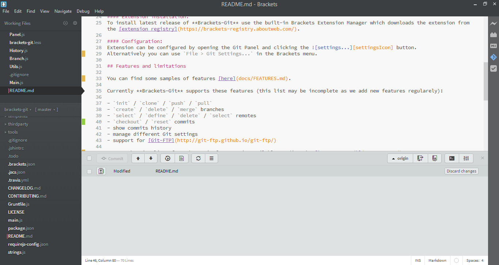
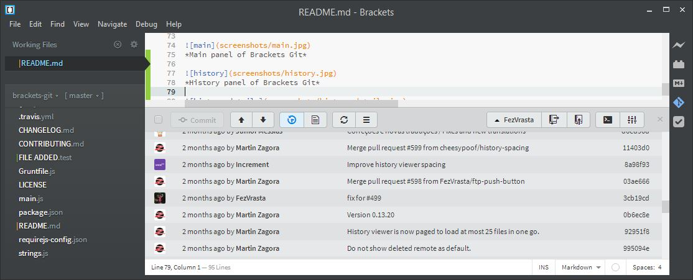
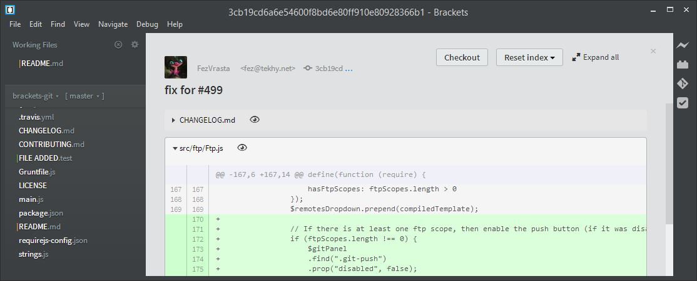
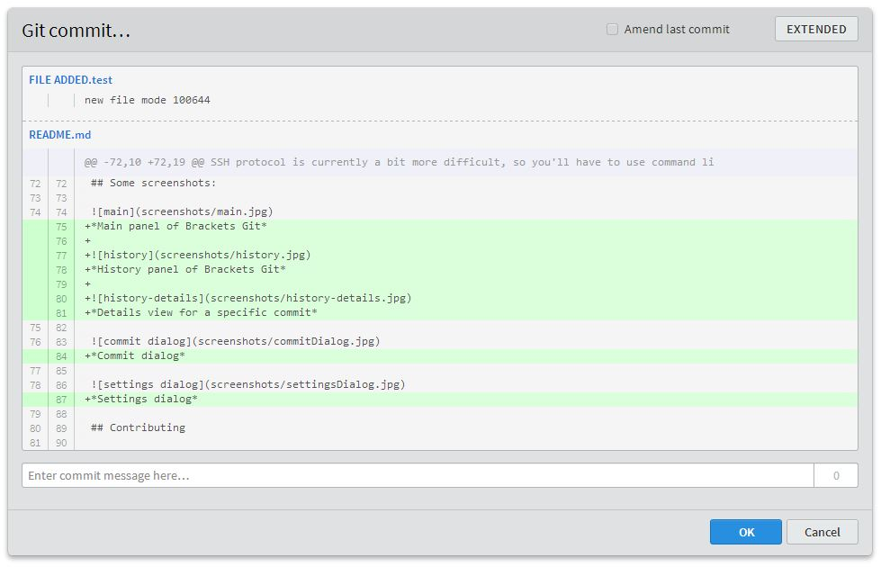
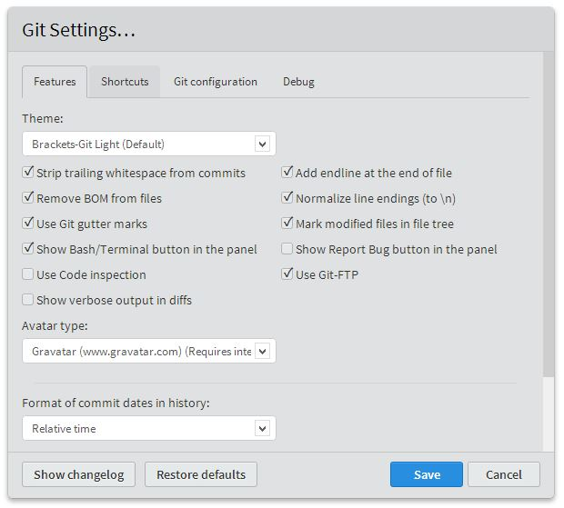

# Brackets-Git [](https://travis-ci.org/zaggino/brackets-git)

Brackets-Git is an extension for [Brackets](http://brackets.io/) editor - it provides Git integration for Brackets.
It's tested and works on any platform supported by Brackets (Windows, Mac OS X, GNU/Linux).

## Installation

#### Dependencies:
To make **Brackets-Git** work you'll need Git installed in your system:

- **Windows**: [Git for Windows](http://msysgit.github.io/) is recommended with these [settings](https://raw.github.com/zaggino/brackets-git/master/screenshots/gitInstall.png).
- **Mac OS X**: [Git for Mac](http://git-scm.com/download/mac) is recommended.
- **GNU/Linux**: Install the package `git`:
   - [Debian/Ubuntu](https://launchpad.net/~git-core/+archive/ppa) using [this guide](http://askmetutorials.blogspot.com.au/2014/03/install-git-191-on-ubuntu-linuxmint.html):

   ```
   sudo add-apt-repository ppa:git-core/ppa
   sudo apt-get update
   sudo apt-get install git
   ```

   - RedHat/CentOS/Fedora: `sudo yum install git`

#### Extension installation:
To install latest release of **Brackets-Git** use the built-in Brackets Extension Manager which downloads the extension from the [extension registry](https://brackets-registry.aboutweb.com/).

#### Configuration:
Extension can be configured by opening the Git Panel and clicking the ![settings...][settingsIcon] button.
Alternatively you can use `File > Git Settings...` in the Brackets menu.

## Features and limitations

You can find some samples of features [here](docs/FEATURES.md).

Currently **Brackets-Git** supports these features (this list may be incomplete as we add new features regularly):

- `init` / `clone` / `push` / `pull`
- `create` / `delete` / `merge` branches
- `select` / `define` / `delete` remotes
- `checkout` / `reset` commits
- show commits history
- manage different Git settings
- support for [Git-FTP](http://git-ftp.github.io/git-ftp/) ([installation instructions](docs/GIT-FTP.md))

A comprehensive list of Brackets-Git features is available reading the [`CHANGELOG.md`](CHANGELOG.md).
Most of the features available are configurable and it's possible to enable and disable them selectively.
If you can't find the feature you were looking for, feel free to [open an issue](https://github.com/zaggino/brackets-git/issues) with your idea(s).

**Pull/Push to password protected repositories:**
Push/Pull from and to password protected repositories is partially supported, currently it works only with `http` / `https` repositories.

The [Git Credential Manager for Windows (GCM)](https://github.com/Microsoft/Git-Credential-Manager-for-Windows) is recommended to manage password protected repositories, **Brackets-Git** will eventually provide better support for them.
You'll need to push manually the first time to setup your username/password into the credentials helper.

**Working with SSH repositories:**
SSH protocol is currently a bit more difficult, so you'll have to use command line or try to follow these [tips](https://github.com/zaggino/brackets-git/issues/524):

- Linux
  - See [help.github.com/articles/generating-ssh-keys/](https://help.github.com/articles/generating-ssh-keys/)

- Mac OSX
  - Create a ssh pair key with the following command on the terminal `$ ssh-keygen -t rsa -b 2048 -C "your@email.com"`
  - Enter a `"Secure"` passphrase or alternativly hit `Enter` twice if you dont want a passphrase `"Not Recommended"`
  - You should be given a string like the following `"99:ff:ff:4b:bb:2d:d3:17:h6:6d:f0:55:4d:f0:b4:db your@email.com"`
  - Pay attention to this line `"Your public key has been saved in /Users/USERNAME/.ssh/id_rsa.pub."` the *.pub is what you want here, take note names may vary. 
  - Now start the SSH agent `"eval "$(ssh-agent -s)" "` Which should give you output like this `"Agent pid 77398"`
  - Next type `"ssh-add ~/.ssh/id_rsa"`
  - Next we want to copy the SSH key into your clipboard, there are two ways of doing this.
  - Method #1 type into Terminal `"pbcopy < ~/.ssh/id_rsa.pub"` taking note of before that "Your file" is names `"id_rsa.pub"`. If it is not, change it to whatever yours may be called. That's it proceed to next step.  
  - Method #2 if for some reason you can't do method #1 this is your alternative. Find the id_rsa.pub key or otherwise named.pub key and open it with a text editor, copy the while key including email into your clipboard (command + c). That's it.
  - DO NOT DELETE THE FILE!
  
  - Now we add the `SSHKEYFILE.pub` to the authorized_keys onto the git server (github website).  
    - Login to Github
    - Click the COG to the top right (settings)
    - Click the left hand side menu `"SSH KEYS"` >> ADD NEW SSH Key
    - Input the name of this key, in my instance I named it `"Macbook Pro Git Key"`
    - Paste your key with (command + c) or right click Paste
    - Click `"ADD KEY"` and you're done (NOTE: You may be asked for a password) 
      
  - Now to test if everything is Working In Terminal Type after the $ `"ssh -T git@github.com"` Type `"Yes"` And close.
  - If it does not connect, check your Internet and that you have not missed a step :)

- Windows (Go to point 3 if you have already a rsa key already generated)

  - Create a ssh pair key with PuttyGen RSA with 2048 bytes. Don't add any password. Save the PPK and upload the public key to the git server.
  - Add the PPK key to the Putty agent.
  - ONLY IF YOU HAVE A RSA Key already from the server. You need to convert the private key to PPK. With PuttyGen load the sshkeyfilename (this file comes without extension, after loaded save it as private key. After that load this key in Putty Agent.
  - Insert (if not already) the pub key to the server inside the folder `/root/.ssh/authorized_keys`. (edit with `vi` the file `authorized_keys` and paste the pub key content on the file.)
  - Putty manage the private keys with a SSH agent always present in the task bar.

## Some screenshots:

  
*Main panel of Brackets Git*

  
*History panel of Brackets Git*

  
*Details view for a specific commit*

  
*Commit dialog*

  
*Settings dialog*

## Contributing

Please see [`CONTRIBUTING.md`](CONTRIBUTING.md)


[settingsIcon]: https://cloud.githubusercontent.com/assets/5382443/2535525/c0e254b0-b58f-11e3-9be3-9024641e5a2a.png
