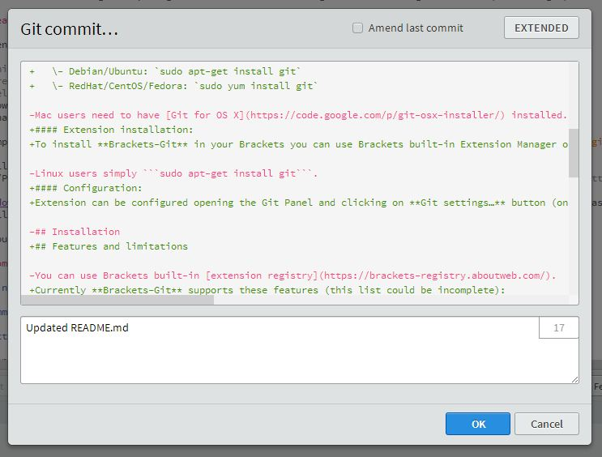
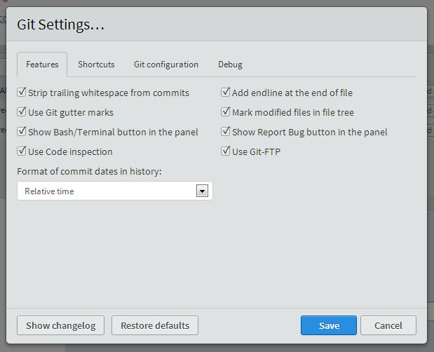

# Brackets-Git

Brackets-Git is an extension for [Brackets](http://brackets.io/) editor - it provides Git integration for Brackets.  
It's tested and works on any platform supported by Brackets (Windows, Mac OSx, GNU/Linux).

## Installation

#### Dependencies:
To make **Brackets-Git** work you'll need Git installed in your system:

- **Windows**: [MsysGit](https://code.google.com/p/msysgit/) is reccomended with these ([settings](https://raw.github.com/zaggino/brackets-git/master/screenshots/gitInstall.png))
- **Mac OS X**: [Git for OS X](https://code.google.com/p/git-osx-installer/) is reccomended.
- **GNU/Linux**: Install the package `git`:  
   \- Debian/Ubuntu: `sudo apt-get install git`  
   \- RedHat/CentOS/Fedora: `sudo yum install git`

#### Extension installation:
To install latest release of **Brackets-Git** use the built-in Brackets Extension Manager which downloads the extension from the [extension registry](https://brackets-registry.aboutweb.com/).

#### Configuration:
Extension can be configured by opening the Git Panel and clicking the ![settings...][settingsIcon] button.  
Alternatively you can use "File > Git Settings..." in the Brackets menu.

## Features and limitations

Currently **Brackets-Git** supports these features (this list may be incomplete as we add new features regularely):

- `init` / `clone` / `push` / `pull`
- `create` / `delete` / `merge` branches
- `select` / `define` / `delete` / `select` remotes
- show commits history
- manage different Git settings
- support for [Git-FTP](http://git-ftp.github.io/git-ftp/)

A comprehensive list of Brackets-Git features is avaiable reading the [`CHANGELOG.md`](CHANGELOG.md).  
Most of the features available are configurable and is possible disable or enable them selectively.

**Pull/Push to password protected repositories:**
Push/Pull from and to password protected repositories is partially supported, currently it works only with `http` / `https` repositories.

[Windows Credential Store for Git](http://gitcredentialstore.codeplex.com/) is reccomanded to better manage password protected repositories till **Brackets-Git** will provide a better support for them.  
You'll need to push manually for the first time to setup your username/password into credentials helper.

If you won't find the feature you were looking for, feel free to **open issues with your ideas**.

## Some screenshots:

## Contributing

Please see [`CONTRIBUTING.md`](CONTRIBUTING.md)

[settingsIcon]: https://cloud.githubusercontent.com/assets/5382443/2535525/c0e254b0-b58f-11e3-9be3-9024641e5a2a.png