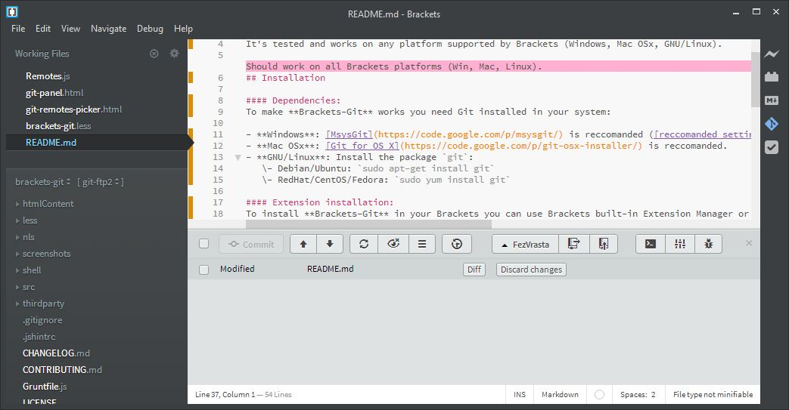

# Brackets-Git

Brackets-Git is an extension for [Brackets](http://brackets.io/) editor - it provides Git integration for Brackets.
It's tested and works on any platform supported by Brackets (Windows, Mac OS X, GNU/Linux).

## Installation

#### Dependencies:
To make **Brackets-Git** work you'll need Git installed in your system:

- **Windows**: [Git for Windows](http://msysgit.github.io/) is recommended with these [settings](https://raw.github.com/zaggino/brackets-git/master/screenshots/gitInstall.png).
- **Mac OS X**: [Git for Mac](http://git-scm.com/download/mac) is recommended.
- **GNU/Linux**: Install the package `git`:
   - [Debian/Ubuntu](https://launchpad.net/~git-core/+archive/ppa) using [this guide](http://askmetutorials.blogspot.com.au/2014/03/install-git-191-on-ubuntu-linuxmint.html):

   ```
   sudo add-apt-repository ppa:git-core/ppa
   sudo apt-get update
   sudo apt-get install git
   ```

   - RedHat/CentOS/Fedora: `sudo yum install git`

#### Extension installation:
To install latest release of **Brackets-Git** use the built-in Brackets Extension Manager which downloads the extension from the [extension registry](https://brackets-registry.aboutweb.com/).

#### Configuration:
Extension can be configured by opening the Git Panel and clicking the ![settings...][settingsIcon] button.
Alternatively you can use `File > Git Settings...` in the Brackets menu.

## Features and limitations

You can find some samples of features [here](docs/FEATURES.md).

Currently **Brackets-Git** supports these features (this list may be incomplete as we add new features regularly):

- `init` / `clone` / `push` / `pull`
- `create` / `delete` / `merge` branches
- `select` / `define` / `delete` remotes
- `checkout` / `reset` commits
- show commits history
- manage different Git settings
- support for [Git-FTP](http://git-ftp.github.io/git-ftp/) ([installation instructions](docs/GIT-FTP.md))

A comprehensive list of Brackets-Git features is available reading the [`CHANGELOG.md`](CHANGELOG.md).
Most of the features available are configurable and it's possible to enable and disable them selectively.
If you can't find the feature you were looking for, feel free to [open an issue](https://github.com/zaggino/brackets-git/issues) with your idea(s).

**Pull/Push to password protected repositories:**
Push/Pull from and to password protected repositories is partially supported, currently it works only with `http` / `https` repositories.

[Windows Credential Store for Git](http://gitcredentialstore.codeplex.com/) is recommended to better manage password protected repositories, **Brackets-Git** will eventually provide better support for them.
You'll need to push manually the first time to setup your username/password into the credentials helper.

**Working with SSH repositories:**
SSH protocol is currently a bit more difficult, so you'll have to use command line or try to follow these [tips](https://github.com/zaggino/brackets-git/issues/524):

- Mac

  - Create a ssh pair key with the following command on the terminal `$ ssh-keygen -t rsa -b 2048 -C "MyCommentedKey"` (Enter twice because we dont need password)
  - Now add the `sshkeyfilename.pub` to the authorized_keys onto the git server. (see some tutorial about this, it is simple)
  - Keep the private file `sshkeyfilename` on your mac, and now add this private key via terminal like this: `$ chmod 600 sshkeyfilename` and `$ ssh-add sshkeyfilename`

- Windows (Go to point 3 if you have already a rsa key already generated)

  - Create a ssh pair key with PuttyGen RSA with 2048 bytes. Don't add any password. Save the PPK and upload the public key to the git server.
  - Add the PPK key to the Putty agent.
  - ONLY IF YOU HAVE A RSA Key already from the server. You need to convert the private key to PPK. With PuttyGen load the sshkeyfilename (this file comes without extension, after loaded Save it as private key. After that load this key in Putty Agent.
  - Insert (if not already) the pub key to the server inside the folder `/root/.ssh/authorized_keys`. (edit with `vi` the file `authorized_keys` and paste the pub key content on the file.)
  - Putty manage the private keys with a SSH agent always present in the task bar.

## Some screenshots:

  
*Main panel of Brackets Git*

  
*History panel of Brackets Git*

  
*Details view for a specific commit*

  
*Commit dialog*

  
*Settings dialog*

## Contributing

Please see [`CONTRIBUTING.md`](CONTRIBUTING.md)


[settingsIcon]: https://cloud.githubusercontent.com/assets/5382443/2535525/c0e254b0-b58f-11e3-9be3-9024641e5a2a.png
