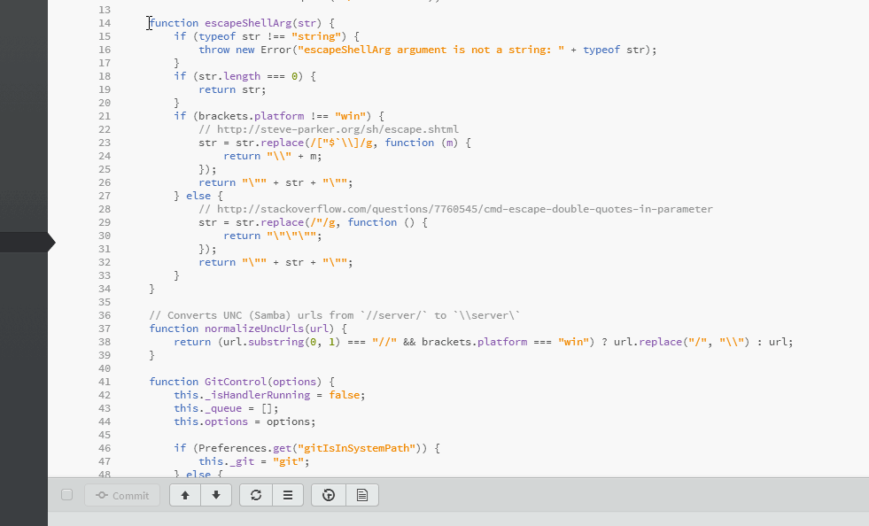
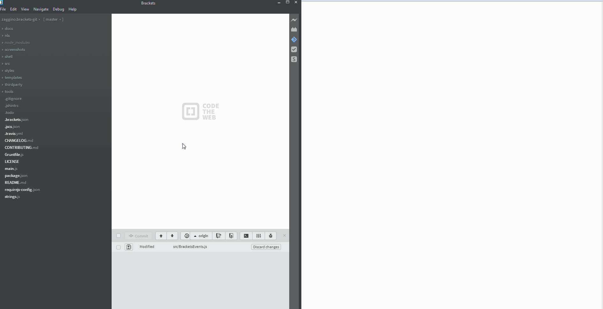

# Feature list

- [View authors / git blame](#blame)
- [Debug mode](#debug)

## Blame

Uses `git blame` to view authors of a file or a selection

## Debug

You can get detailed git communication and events to the console with simple setting.
*Don't forget to turn this off as it really slows things down while working.*

(animations captured with LICEcap)